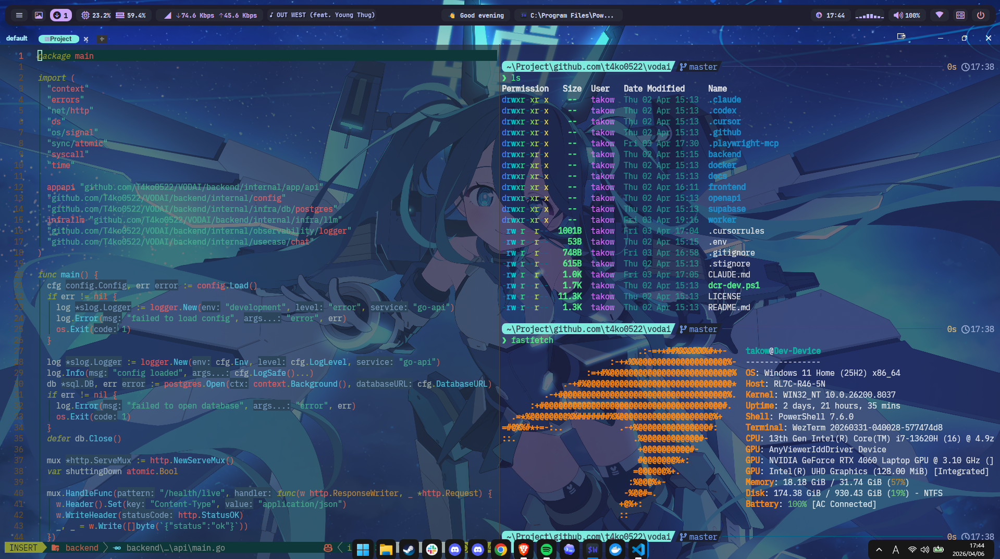

# Dotfiles
Windowsを使いましょう！！！！

[](https://www.microsoft.com/windows/)
[](https://neovim.io/)
[](https://wezfurlong.org/wezterm/)
[](https://github.com/PowerShell/PowerShell)
[](https://mise.jdx.dev/)  
Is this Windows? for real?


## Setup

```powershell
# 1. Clone
git clone https://github.com/T4ko0522/dotfiles
cd dotfiles

# 2. 依存関係を一括インストール (管理者の pwsh で実行)
#    winget で必須群 → Scoop → bucket (extras / nerd-fonts / t4ko0522) → CLI ツール
pwsh -ExecutionPolicy Bypass -File .\.bin\bootstrap.ps1

# 3. シンボリックリンク・設定の配置
pwsh -ExecutionPolicy Bypass -File .\.bin\setup_windows.ps1

# 4. mise でランタイム・CLI ツールをインストール
mise trust
mise install
```

## Claude Code Switch

```powershell
# native installer -> claude
pwsh -ExecutionPolicy Bypass -File .\.bin\switch_claude_code.ps1 native

# mise npm install -> claude
pwsh -ExecutionPolicy Bypass -File .\.bin\switch_claude_code.ps1 npm

# show current launcher status
pwsh -ExecutionPolicy Bypass -File .\.bin\switch_claude_code.ps1 status
```
